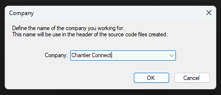
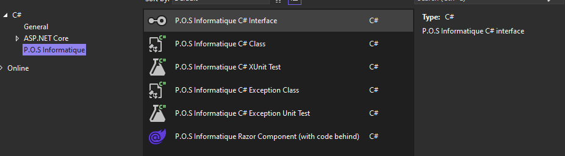

# P.O.S Informatique Visual Studio Templates

This repository contains Visual Studio templates of P.O.S Informatique company and can be used
as *white label* when working for different customers.

These templates follow the [StyleCop](https://github.com/DotNetAnalyzers/StyleCopAnalyzers)
and [Microsoft coding conventions](https://learn.microsoft.com/en-us/dotnet/csharp/fundamentals/coding-style/coding-conventions).

- [White label companies of the templates](#white-label-companies-of-the-templates)
  - [Companies settings file](#companies-settings-file)
- [Visual Studio item templates](#visual-studio-item-templates)
- [Packaging of the Visual Studio Templates](#packaging-of-the-visual-studio-templates)
  - [Build the VSIX package](#build-the-vsix-package)
  - [Generate the ATOM feed for the private extensions gallery](#generate-the-atom-feed-for-the-private-extensions-gallery)
- [Build and deploy the Visual Studio templates](#build-and-deploy-the-visual-studio-templates)
- [Install the Visual Studio Templates](#install-the-visual-studio-templates)

## White label companies of the templates
If you work in a *Digital Services Company* with multiple customers, the source code edited
belong to your customer and maybe you have to write the customer company name on the header.

For example, for the *P.O.S Informatique* company:
```csharp
//-----------------------------------------------------------------------
// <copyright file="CustomerManager.cs" company="P.O.S Informatique">
//     Copyright (c) P.O.S Informatique. All rights reserved.
// </copyright>
//-----------------------------------------------------------------------
```

If you switch to another customer called *Chantier Connect*, the header of the C# files
will be:
```csharp
//-----------------------------------------------------------------------
// <copyright file="CustomerManager.cs" company="Chantier Connect">
//     Copyright (c) Chantier Connect. All rights reserved.
// </copyright>
//-----------------------------------------------------------------------
```

It is not easy to have manage and have different templates for each customers.

To fix this issue and allow to work with different companies with the same Visual Studio instance, these
templates will ask you the name of the company to put on the header.



### Companies settings file

The company name is asked only once for each solution.
The association between the company and the solutions are saved in the following mapping file:

```
C:\Users\<Windows user>\AppData\Roaming\P.O.S Informatique\Visual Studio\Templates\Companies.json
```

If you need to reset the mapping association between the company and solutions, just delete
this file. The Visual Studio extension will ask you again the name of the company when adding
a file with the template.

> **NOTE**: We use this strategy in order to avoid be intrusive in your repository source code
by saving additional information (inside file, .sln,...) for this extension. We would
like that the source codes of the respository must be separated of the Visual Studio extensions used.

## Visual Studio item templates
The [PosInformatique.VisualStudio.Templates.sln](PosInformatique.VisualStudio.Templates.sln) solution contains 2 projects:
- **VisualStudio.Templates**: Allows to generate a VSIX package for the Visual Studio extension.
- **VisualStudio.Templates.Files**: Contains the following item templates:
  - [Class.cs](./src/VisualStudio.Templates.Files/Class.cs): C# class
  - [Exception.cs](./src/VisualStudio.Templates.Files/Exception.cs): C# exception class
  - [ExceptionUnitTest.cs](./src/VisualStudio.Templates.Files/ExceptionUnitTest.cs): C# exception unit test class
  - [Interface.cs](./src/VisualStudio.Templates.Files/Interface.cs): C# interface
  - [XUnitTest.cs](./src/VisualStudio.Templates.Files/XUnitTest.cs): C# XUnit test class



## Packaging of the Visual Studio Templates
The [VisualStudio.Templates.package.proj](./VisualStudio.Templates.package.proj)
file is a MSBuild script which allows to perform the following operations:
- Build the VSIX package of the Visual Studio Templates
- Generate the ATOM file used to publish the Visual Studio extension inside a private extensions gallery.

### Build the VSIX package.
To build the VSIX package:
- Open the **Developer Command Prompt for VS2022**.
- Go to the root directory of the repository.
- Execute the following command:

```cmd
msbuild PosInformatique.VisualStudio.Templates.package.proj /t:Build /p:OutDir="<Output folder>"
```

With `<Output folder>` the folder where the VSIX package.

### Generate the ATOM feed for the private extensions gallery.
To generate the ATOM feed:
- Open the **Developer Command Prompt for VS2022**.
- Go to the root directory of the repository.
- Execute the following command:

```cmd
msbuild PosInformatique.VisualStudio.Templates.package.proj /t:Publish /p:OutDir="<Output folder>" /p:PublishUrl="<Publish URL>"
```

With:
- `<Output folder>` the folder where the VSIX package and the ATOM feed will be generated
- `<Publish URL>` the URL where you would like to publish your extensions in private extensions gallery.

## Build and deploy the Visual Studio templates
To deploy the Visual Studio you can use the
[build/azure-pipelines-release.yaml](./build/azure-pipelines-release.yaml)
Azure Pipeline YAML provided in the repository.

This Azure Pipeline YAML allows to publish the Visual Studio Templates extensions
inside an Azure Web App and required 1 parameter:
- `Version`: The version of the Visual Studio Templates extensions to build.

And 2 variables:
- `AzureSubscription`: The name of the Azure Subscription which contains the Azure Web App
- `WebAppName`: The name of the Azure Web App where to publish the extensions.

The extensions will be publish inside a sub folder named `visualstudio-extensions`.

The extensions after published will be available in private extensions gallery with the following URL:
`https://<WebAppName>.azurewebsites.net/visualstudio-extensions/`.

> **NOTE**: You do not need to fork this repository, you can plug this repository to you own Azure Pipeline.

## Install the Visual Studio Templates
In the case your the extension is deployed in a private extensions gallery.

To install the Visual Studio Templates, add the P.O.S Informatique extension gallery:
- Click to the **Tools**/**Options** menu.
- Add an additional extension gallery with the following settings:
  - **Name**: `P.O.S Informatique`
  - **URL**: `<Publish URL>` (The URL when you published the ATOM feed that contains the VSIX file.)

After the extension gallery has been added, developers can install the Visual Studio extension
from the extensions manager of Visual Studio:
- Click on the **Extensions**/**Manage Extensions** menu.
- Select the **Online**/**P.O.S Informatique** gallery.
- Download and install the **P.O.S Informatique Visual Studio Templates**.