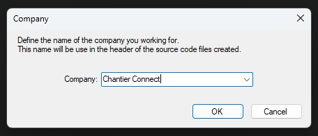
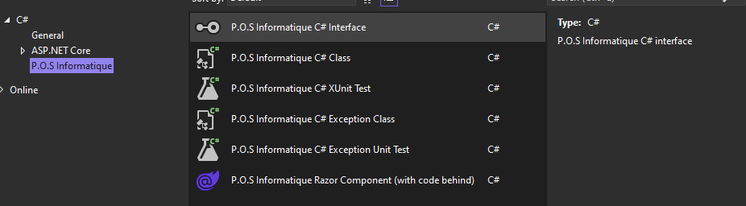

# P.O.S Informatique Visual Studio Templates

This repository contains Visual Studio templates from P.O.S Informatique and can be used
as *white-label* templates when working for different customers.

These templates follow the [StyleCop](https://github.com/DotNetAnalyzers/StyleCopAnalyzers)
and [Microsoft coding conventions](https://learn.microsoft.com/en-us/dotnet/csharp/fundamentals/coding-style/coding-conventions).

- [White label companies of the templates](#white-label-companies-of-the-templates)
  - [Companies settings file](#companies-settings-file)
- [Visual Studio item templates](#visual-studio-item-templates)
- [Packaging of the Visual Studio Templates](#packaging-of-the-visual-studio-templates)
  - [Build the VSIX package](#build-the-vsix-package)
  - [Generate the ATOM feed for the private extensions gallery](#generate-the-atom-feed-for-the-private-extensions-gallery)
- [Build and deploy the Visual Studio templates](#build-and-deploy-the-visual-studio-templates)
- [Install the Visual Studio Templates](#install-the-visual-studio-templates)

## White label companies of the templates
If you work in a *Digital Services Company* with multiple customers, the source code you edit
belongs to your customer, and you may need to write the customer's company name in the header.

For example, for the *P.O.S Informatique* company:
```csharp
//-----------------------------------------------------------------------
// <copyright file="CustomerManager.cs" company="P.O.S Informatique">
//     Copyright (c) P.O.S Informatique. All rights reserved.
// </copyright>
//-----------------------------------------------------------------------
```

If you switch to another customer called *Chantier Connect*, the header of the C# files
will be:
```csharp
//-----------------------------------------------------------------------
// <copyright file="CustomerManager.cs" company="Chantier Connect">
//     Copyright (c) Chantier Connect. All rights reserved.
// </copyright>
//-----------------------------------------------------------------------
```

It is not easy to manage different templates for each customer.

To fix this issue and allow you to work with different companies in the same Visual Studio instance, these
templates will read the `stylecop.json` file in your project and extract the company name.
See the [Configuring StyleCop Analyzers](https://github.com/DotNetAnalyzers/StyleCopAnalyzers/blob/master/documentation/Configuration.md)
for more information.

If no `stylecop.json` file exists, a wizard will be displayed to ask you the name of the company to put on the header.



### Companies settings file

If there is no `stylecop.json` file associated with the project, the company name is requested
only once for each solution stored on your computer.
The association between the company and the solutions is saved in the following mapping file:

```
C:\Users\<Windows user>\AppData\Local\P.O.S Informatique\Visual Studio\Templates\Companies.json
```

If you need to reset the mapping association between the company and solutions, just delete
this file. The Visual Studio extension will ask you again the name of the company when adding
a file with the template.

> **NOTE**: We use this strategy to avoid being intrusive in your repository source code
by saving additional information (inside files, .sln, ...) for this extension. We would
like the source code in the repository to remain separate from the Visual Studio extensions used.

## Visual Studio item templates
The [PosInformatique.VisualStudio.Templates.sln](PosInformatique.VisualStudio.Templates.sln) solution contains 2 projects:
- **VisualStudio.Templates**: Generates a VSIX package for the Visual Studio extension.
- **VisualStudio.Templates.Files**: Contains the following item templates:
  - [Class.cs](./src/VisualStudio.Templates.Files/Class.cs): C# class
  - [Exception.cs](./src/VisualStudio.Templates.Files/Exception.cs): C# exception class
  - [ExceptionUnitTest.cs](./src/VisualStudio.Templates.Files/ExceptionUnitTest.cs): C# exception unit test class
  - [Interface.cs](./src/VisualStudio.Templates.Files/Interface.cs): C# interface
  - [RazorComponent.razor](./src/VisualStudio.Templates.Files/RazorComponent.razor): Razor component (a separate code behind C# class is included)
    - [RazorComponent.razor.cs](./src/VisualStudio.Templates.Files/RazorComponent.razor.cs): Razor component code behind (in C#).
  - [XUnitTest.cs](./src/VisualStudio.Templates.Files/XUnitTest.cs): C# XUnit test class

All templates respect the `.editorconfig` settings of your project, particularly for:
- `insert_final_newline`: Automatically adds a final newline at the end of files
- `csharp_style_namespace_declarations`: Respects your namespace style preference (file-scoped or block-scoped)



## Packaging of the Visual Studio Templates
The [VisualStudio.Templates.package.proj](./VisualStudio.Templates.package.proj)
file is an MSBuild script that allows you to perform the following operations:
- Build the VSIX package of the Visual Studio Templates
- Generate the ATOM file used to publish the Visual Studio extension inside a private extensions gallery.

### Build the VSIX package.
To build the VSIX package:
- Open the **Developer Command Prompt for VS2022**.
- Go to the root directory of the repository.
- Execute the following command:

```cmd
msbuild VisualStudio.Templates.package.proj /t:Build /p:OutDir="<Output folder>"
```

Where `<Output folder>` is the folder where the VSIX package will be generated.

### Generate the ATOM feed for the private extensions gallery.
To generate the ATOM feed:
- Open the **Developer Command Prompt for VS2022**.
- Go to the root directory of the repository.
- Execute the following command:

```cmd
msbuild VisualStudio.Templates.package.proj /t:Publish /p:OutDir="<Output folder>" /p:PublishUrl="<Publish URL>"
```

With:
- `<Output folder>` the folder where the VSIX package and the ATOM feed will be generated
- `<Publish URL>` the URL where you would like to publish your extensions in a private extensions gallery.

## Build and deploy the Visual Studio templates
To deploy the Visual Studio templates, you can use the
[build/azure-pipelines-release.yaml](./build/azure-pipelines-release.yaml)
Azure Pipelines YAML file provided in the repository.

This Azure Pipelines YAML file allows you to publish the Visual Studio Templates extensions
inside an Azure Web App and requires 1 parameter:
- `Version`: The version of the Visual Studio Templates extensions to build.

And 2 variables:
- `AzureSubscription`: The name of the Azure Subscription which contains the Azure Web App
- `WebAppName`: The name of the Azure Web App where the extensions are published.

The extensions will be published inside a subfolder named `visualstudio-extensions`.

After being published, the extensions will be available in a private extensions gallery at the following URL:
`https://<WebAppName>.azurewebsites.net/visualstudio-extensions/`.

> **NOTE**: You do not need to fork this repository; you can plug this repository into your own Azure Pipeline.

## Install the Visual Studio Templates
If the extension is deployed in a private extensions gallery.

To install the Visual Studio Templates, add the P.O.S Informatique extension gallery:
- Click on the **Tools**/**Options** menu.
- Add an additional extension gallery with the following settings:
  - **Name**: `P.O.S Informatique`
  - **URL**: `<Publish URL>` (The URL when you published the ATOM feed that contains the VSIX file.)

After the extension gallery has been added, developers can install the Visual Studio extension
from the extensions manager of Visual Studio:
- Click on the **Extensions**/**Manage Extensions** menu.
- Select the **Online**/**P.O.S Informatique** gallery.
- Download and install the **P.O.S Informatique Visual Studio Templates**.
